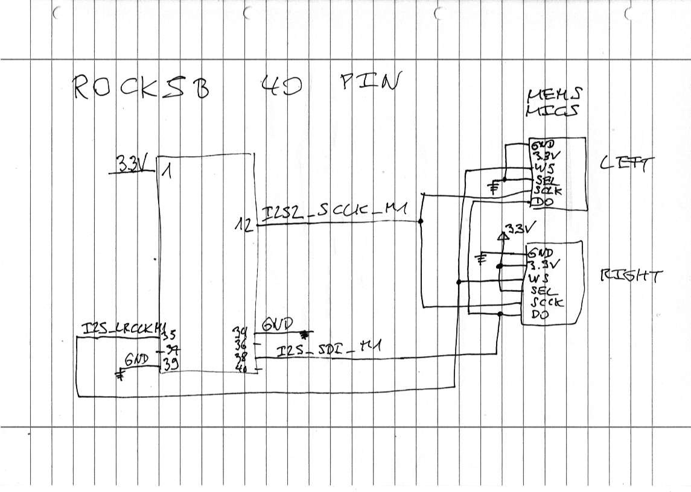

# Adaptive directional hearing aid

## Hardware

 - Rock5B or Rock5B+
 - MEMS I2S mics

## Software prerequisites

 - Install Armbian trixie, vendor with kernel `Linux rock-5b 6.1.115-vendor-rk35xx`.

 - Install the following packages:

```
apt install libasound2-dev cmake build-essential g++ pkgconf xauth x11-apps xfonts-base 
```

 - Install the FIR / LMS filter library: https://github.com/berndporr/fir1
```
cmake .
make
sudo make install
```

## MEMS mics

The current mics are from DFR robot: https://wiki.dfrobot.com/sen0526/

Install the device tree with:

```
sudo armbian-add-overlay mems_mic_i2s2_m1.dts
```

Reboot.

Check with:

```
arecord -l
```
if you see the dummy card:

```
card 5: memsmiccard [mems-mic-card], device 0: fe490000.i2s-dummy_codec dummy_codec-0 [fe490000.i2s-dummy_codec dummy_codec-0]
  Subdevices: 1/1
  Subdevice #0: subdevice #0
```

Wire up the MEMS mics:



and record some sound from the mics:

```
arecord -D hw:memsmiccard -c 2 -r 44100 -f S16_LE /tmp/audio.wav
```

## Headphone

The Rock5 has an internal sound card. Test it with:

```
aplay -D plughw:rockchipes8316,0 /usr/share/sounds/alsa/Front_Center.wav
```

If you don't hear anything it's most likely that the volume of the headphone is zero.
Use `alsamixer` to bump up the volume.

## Building

```
cmake .
make
```

## LMS filter

This uses a classical LMS filter to cancel out sound from the side. Run with

```
./fir_filtering
```

## Tests

### Capture

```
./test_recording
```

Records to the `/tmp` directory the file 
`/tmp/test_recording.dat`. Which can be converted by `sox` to a wave
file with `sox test_recording.dat test_recording.wav` or played with `sox test_recording.dat -d`.

### Playback

```
./test_playback
```

plays a 1kHz sine wave in stereo.

### Low latency passthrough

```
./test_passthrough
```
sends simply the data from the mics to the headphones.

## Credit

 - Bernd Porr
 - Ross Cameron
